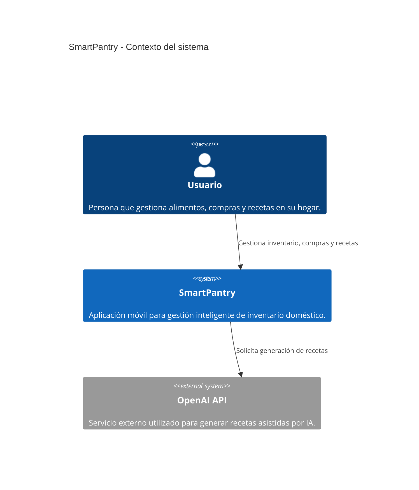
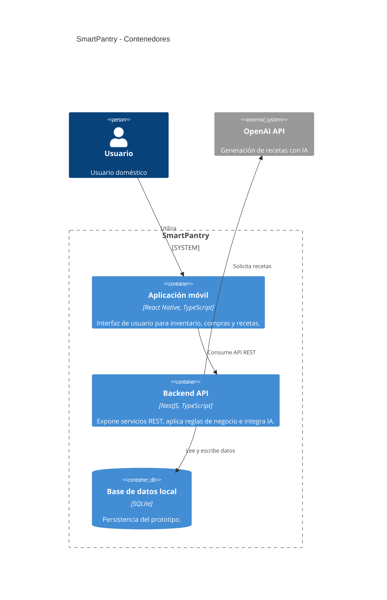
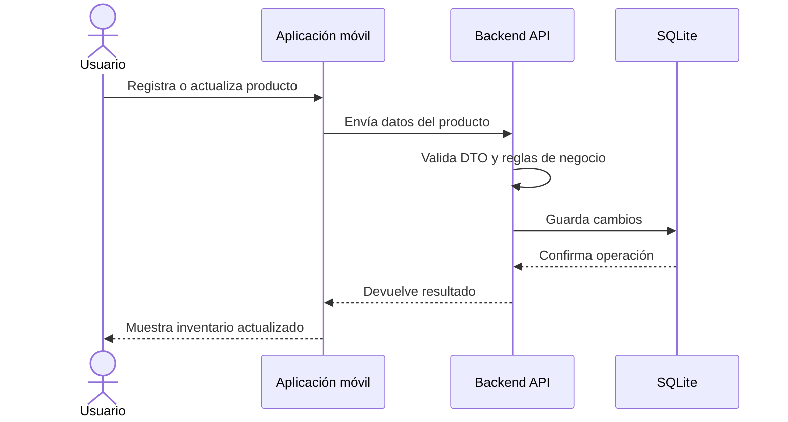
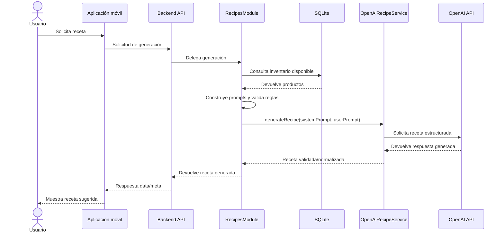

# Arquitectura del sistema

# SmartPantry

Versión: 1.0

---

# 1. Propósito

Este documento describe la arquitectura técnica de SmartPantry, incluyendo sus componentes principales, responsabilidades, límites, decisiones arquitectónicas y relaciones entre frontend, backend, persistencia e Inteligencia Artificial.

La arquitectura definida busca servir como referencia para el desarrollo del MVP y como base documental para el Trabajo Fin de Máster.

---

# 2. Objetivos arquitectónicos

La arquitectura de SmartPantry persigue los siguientes objetivos:

- separar claramente la interfaz móvil, la lógica de negocio, la persistencia y la integración con servicios externos;
- permitir el desarrollo incremental del MVP;
- mantener una estructura comprensible para un desarrollo individual;
- facilitar pruebas unitarias, de integración y validaciones manuales;
- proteger las claves de servicios externos, especialmente OpenAI API;
- permitir una evolución futura hacia sincronización, autenticación y persistencia remota;
- desacoplar la lógica de negocio del motor concreto de persistencia;
- generar evidencia técnica reutilizable en la memoria del TFM.

---

# 3. Principios de arquitectura

El sistema se diseñará bajo los siguientes principios:

- modularidad;
- simplicidad;
- mantenibilidad;
- separación de responsabilidades;
- tipado estricto con TypeScript;
- bajo acoplamiento entre frontend y backend;
- contratos explícitos entre capas;
- uso responsable de servicios de IA;
- documentación de decisiones relevantes mediante ADR.

---

# 4. Vista general

SmartPantry estará compuesto por los siguientes elementos principales:

- aplicación móvil desarrollada en React Native;
- backend API desarrollado en NestJS;
- persistencia local mediante SQLite;
- integración con OpenAI API para generación de recetas;
- documentación técnica y académica asociada al desarrollo.

La aplicación móvil será el punto de interacción con el usuario. El backend concentrará la lógica de negocio, los contratos de API y la integración con servicios externos. La persistencia local permitirá conservar los datos del prototipo y facilitar el funcionamiento del MVP.

---

# 5. Modelo C4

## 5.1 Nivel 1: Contexto del sistema



SmartPantry actúa como intermediario entre el usuario y los servicios inteligentes de generación de recetas. El usuario no interactúa directamente con OpenAI API.

---

## 5.2 Nivel 2: Contenedores



Esta división permite mantener la aplicación móvil desacoplada de la lógica de negocio y de los servicios externos.

---

# 6. Componentes principales

## 6.1 Aplicación móvil

La aplicación móvil será responsable de:

- mostrar el inventario;
- permitir el registro y edición de productos;
- gestionar la lista de compras;
- solicitar recetas;
- mostrar estados de carga, error y éxito;
- consumir servicios del backend mediante contratos definidos.

La aplicación móvil no debe contener claves privadas ni lógica compleja de generación de recetas.

---

## 6.2 Backend API

El backend será responsable de:

- exponer endpoints REST;
- validar entradas;
- aplicar reglas de negocio;
- gestionar productos, inventario, compras y recetas;
- centralizar la integración con OpenAI API mediante servicios internos;
- devolver respuestas consistentes al frontend.

---

## 6.3 Persistencia

La persistencia inicial se basará en SQLite.

Se almacenarán principalmente:

- productos;
- categorías;
- cantidades disponibles;
- stock mínimo;
- elementos de lista de compras;

Aunque SQLite será la tecnología concreta utilizada en esta primera versión, el acceso a datos no se realizará directamente desde las pantallas ni desde la lógica de presentación. En su lugar, se definirá una capa de abstracción de persistencia compuesta por servicios o repositorios.

Esta capa tendrá como objetivo desacoplar la lógica de negocio del mecanismo concreto de almacenamiento, permitiendo que en futuras iteraciones SQLite pueda ser sustituido o complementado por una solución más robusta, como PostgreSQL, una API remota o un sistema de sincronización en la nube.

De este modo, el sistema podrá evolucionar sin modificar de forma significativa los casos de uso, las reglas de negocio ni la interfaz de usuario.

---

## 6.4 OpenAI API

OpenAI API se utilizará para generar recetas a partir del inventario disponible.

El backend será el único componente autorizado para comunicarse con OpenAI API.

La respuesta de IA será tratada como sugerencia, no como verdad garantizada.

La integración actual se encapsula en `OpenAiRecipeService`, consumido por `RecipesService`.

El servicio interno de IA:

- lee configuración desde variables de entorno (`OPENAI_API_KEY`, `OPENAI_MODEL`);
- utiliza salida estructurada (`json_schema`) para reforzar el contrato `GeneratedRecipe`;
- valida la estructura recibida antes de devolver la receta al controlador.

---

## 6.5 Flujo interno de RecipesModule

`RecipesModule` aplica la secuencia interna:

1. `RecipesController` recibe `POST /api/v1/recipes/generate`.
2. `RecipesService` consulta inventario disponible vía `ProductsService`.
3. Si no hay productos con `quantity > 0`, responde `BUSINESS_RULE_ERROR`.
4. `RecipesService` construye prompts (`RECIPE_SYSTEM_PROMPT` + prompt dinámico de usuario).
5. `OpenAiRecipeService` solicita la receta a OpenAI y normaliza la salida.
6. Se devuelve respuesta final en contrato `data/meta`.

---

# 7. Módulos backend (estado actual)

Módulos implementados actualmente en backend:

| Módulo | Responsabilidad |
|---|---|
| HealthModule | Verificación de disponibilidad del backend y estado de persistencia |
| ProductsModule | Gestión de productos base (CRUD y reglas de inventario relacionadas) |
| ShoppingListModule | Gestión de productos pendientes de compra y traspaso a inventario al comprar |
| RecipesModule | Generación de recetas con IA, validación de inventario disponible y construcción de prompts |
| PersistenceModule | Capa de abstracción para acceso a datos. Inicialmente implementada con SQLite, pero diseñada para permitir sustitución futura por otra tecnología de persistencia. |

Componente interno relevante de `RecipesModule`:

- `OpenAiRecipeService`: integración encapsulada con OpenAI API.

---

# 8. Estructura prevista del frontend

La aplicación móvil se organizará de forma modular:

```text
frontend/
├── src/
│   ├── screens/
│   ├── components/
│   ├── hooks/
│   ├── services/
│   ├── types/
│   ├── navigation/
│   └── utils/
```

Responsabilidades:

| Carpeta | Responsabilidad |
|---|---|
| screens | Pantallas principales |
| components | Componentes reutilizables |
| hooks | Lógica reutilizable de interfaz |
| services | Comunicación con backend |
| types | Tipos compartidos del frontend |
| navigation | Configuración de navegación |
| utils | Funciones auxiliares |

---

# 9. Flujo principal de datos

## 9.1 Gestión de inventario



---

## 9.2 Generación de receta



---

# 10. Modelo de datos conceptual

## Producto

Representa un alimento registrado en el sistema.

Campos previstos:

- id;
- nombre;
- categoría;
- unidad de medida;
- cantidad disponible;
- stock mínimo;
- fecha de creación;
- fecha de actualización.

## Categoría

Representa una agrupación lógica de productos.

Campos previstos:

- id;
- nombre.

## Elemento de lista de compras

Representa un producto pendiente de adquirir.

Campos previstos:

- id;
- producto;
- cantidad requerida;
- unidad de medida;
- estado;
- fecha de creación.

---

# 11. Contratos entre capas

## Frontend → Backend

El frontend se comunicará con el backend mediante API REST.

Los contratos se documentarán en `docs/api-design.md`.

## Backend → Persistencia

El backend accederá a la persistencia mediante servicios o repositorios.

Los controladores no deben acceder directamente a SQLite.

## Backend → OpenAI

La integración con OpenAI debe estar encapsulada en un servicio específico.

---

# 12. Seguridad

Para el MVP se consideran las siguientes medidas:

- no exponer claves de OpenAI en frontend;
- utilizar variables de entorno para claves y configuración;
- validar entradas recibidas por API;
- evitar enviar información innecesaria a servicios externos;
- documentar limitaciones de seguridad del prototipo.

La autenticación avanzada queda fuera del alcance inicial.

---

# 13. Calidad y pruebas

La arquitectura debe facilitar:

- pruebas unitarias de servicios;
- pruebas de endpoints;
- pruebas de componentes frontend;
- validación manual de flujos principales;
- documentación de evidencia de pruebas.

Los criterios detallados se documentarán en `docs/test-plan.md`.

---

# 14. Decisiones arquitectónicas iniciales

| Decisión | Justificación |
|---|---|
| React Native | Permite desarrollar una aplicación móvil multiplataforma con TypeScript. |
| NestJS | Favorece una arquitectura backend modular y mantenible. |
| SQLite | Suficiente para el prototipo y adecuado para persistencia local/simple. |
| OpenAI API | Permite incorporar generación de recetas asistida por IA. |
| API REST | Facilita contratos claros entre frontend y backend. |
| TypeScript | Mejora mantenibilidad, tipado y prevención de errores. |

Estas decisiones podrán formalizarse posteriormente mediante ADRs.

---

# 15. Riesgos y limitaciones

| Riesgo o limitación | Mitigación |
|---|---|
| Respuestas no deterministas de IA | Tratar recetas como sugerencias y validar estructura básica. |
| Alcance excesivo | Mantener MVP acotado y documentar trabajo futuro. |
| Complejidad de sincronización | Dejar sincronización avanzada fuera del MVP. |
| Exposición de claves | Centralizar OpenAI en backend. |
| Persistencia limitada | Usar arquitectura preparada para evolución futura. |
| Las recetas no se conservan entre sesiones | Aceptado como decisión de alcance del MVP. La persistencia de recetas se considera trabajo futuro. |

---

# 16. Trabajo futuro arquitectónico

Posibles líneas de evolución:

- autenticación de usuarios;
- sincronización en la nube;
- persistencia remota con PostgreSQL;
- multiusuario por hogar;
- integración con supermercados;
- escaneo de códigos de barras;
- reconocimiento de productos con cámara;
- historial de recetas;
- analítica de consumo y desperdicio.